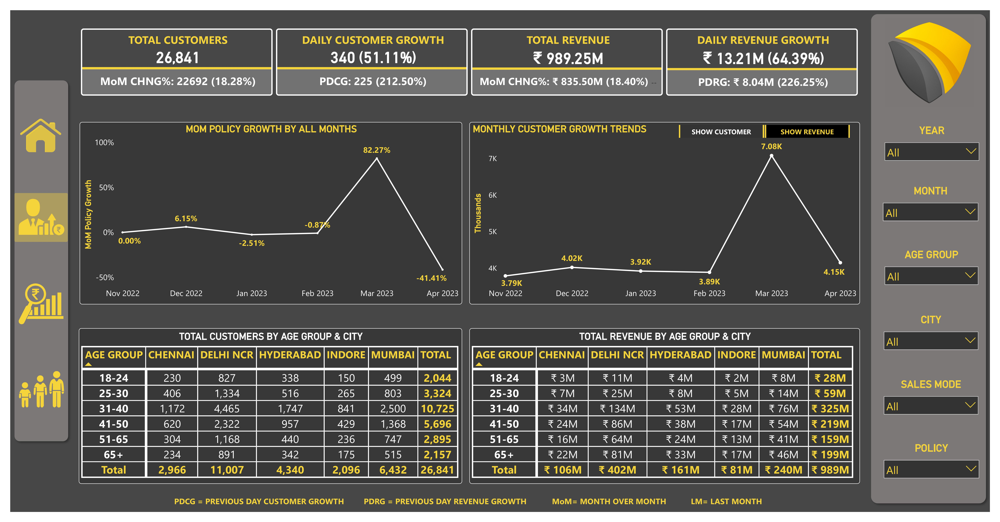
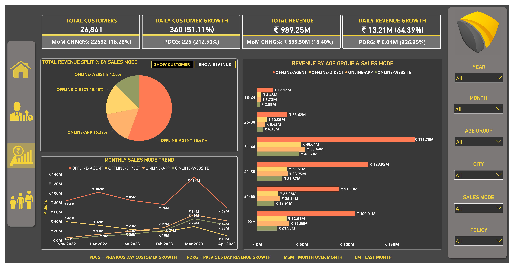
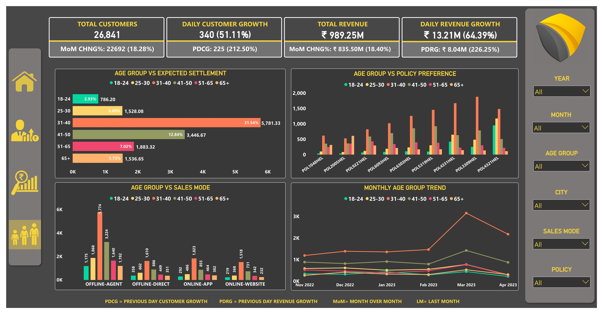

# 🛡️ Shield Insurance – Power BI Analytics Dashboard

## 📊 Project Overview

The Shield Insurance Pilot Project is an interactive Power BI dashboard designed to transform insurance business data into meaningful and actionable insights.

The project focuses on analyzing customer growth, revenue performance, policy trends, sales channels, customer demographics, and settlement patterns.

The dashboard was developed to answer key business questions and help stakeholders identify growth opportunities, understand customer behavior, and improve sales and marketing strategies.

[Live Power BI Dashboard](https://app.powerbi.com/view?r=eyJrIjoiZTE1MmFkMzUtZmFkZi00MWNjLWFjNzYtZjM0NzJmZTc2NmY0IiwidCI6ImM2ZTU0OWIzLTVmNDUtNDAzMi1hYWU5LWQ0MjQ0ZGM1YjJjNCJ9](https://app.powerbi.com/view?r=eyJrIjoiNjJiYTcyMmQtN2I5Yi00NWQ1LWI2YmItNTNiNTE3YWY3NzJhIiwidCI6ImM2ZTU0OWIzLTVmNDUtNDAzMi1hYWU5LWQ0MjQ0ZGM1YjJjNCJ9&disablecdnExpiration=1788392711)

[View LinkedIn Post](https://www.linkedin.com/posts/ankkitkumarguppta_business-insights-360-activity-7255948922123145216-shIp?utm_source=share&utm_medium=member_desktop](https://lnkd.in/p/d9w4WENi)

---
## 🔍 Key Insights

- Total Customers: 26,841
- Total Revenue: ₹989.25M
- Month-over-Month Customer Growth: 18.28%
- Month-over-Month Revenue Growth: 18.40%
- Highest Revenue Age Group: 31–40 years
- Highest Customer Age Group: 31–40 years
- Highest Revenue City: Delhi NCR
- Highest Revenue Sales Mode: Offline-Agent
- Offline-Agent Revenue Contribution: 55.67%
- Peak Customer Growth: January 2023
- Peak Monthly Revenue: Approximately ₹134M in January 2023
---
## 🎯 Business Questions

1. How many customers does Shield Insurance currently have?
2. What is the total revenue generated?
3. What is the daily customer and revenue growth?
4. How are policies changing month-over-month?
5. Which age groups generate the most customers and revenue?
6. How do customers and revenue vary by city and age group?
7. Which sales mode contributes the most revenue?
8. How does sales-mode performance change month-over-month?
9. What are the expected settlement patterns across age groups?
10. Which policies are preferred by different age groups?
11. How can customer and revenue trends support better business decisions?

---

## 🛠️ Tools & Technologies

- Microsoft Power BI
- Power Query
- DAX
- Data Modeling
- Data Visualization
- Business Intelligence
- Data Analysis
---

## 🗂️ Dataset

The project uses five CSV files:

- `dim_customer.csv` – Customer information, date of birth, and city
- `dim_date.csv` – Daily and monthly date information
- `dim_policies.csv` – Policy and premium information
- `fact_premiums.csv` – Policy sales, customers, sales mode, and premium amounts
- `fact_settlements.csv` – Age-wise settlement information

## 📑 Dashboard Pages

### 1. General View

Provides an overview of:

- Customer KPIs
- Revenue KPIs
- Customer growth
- Revenue growth
- Policy growth
- Age-group analysis
- City-wise performance

### 2. Sales Mode Analysis

Analyzes:

- Revenue by sales mode
- Revenue split
- Customer distribution
- Monthly sales-mode trends
- Age group vs sales mode

### 3. Age Group Analysis

Analyzes:

- Expected settlement
- Sales mode preference
- Policy preference
- Monthly age-group trends

---

## 💡 Key Business Recommendations

- Focus marketing initiatives on the 31–40 age group, which represents the strongest customer and revenue segment.
- Continue strengthening the Offline-Agent channel due to its significant contribution to total revenue.
- Explore digital acquisition strategies for younger customer segments.
- Monitor month-over-month policy fluctuations to identify changing customer demand.
- Use city and age-group segmentation to develop more targeted insurance campaigns.
---

## 📸 Dashboard Preview

### General View

### Sales Mode Analysis

### Age Group Analysis

---

## 👤 Project

**Shield Insurance – Pilot Project**

Built using Microsoft Power BI to convert insurance data into actionable business insights.
